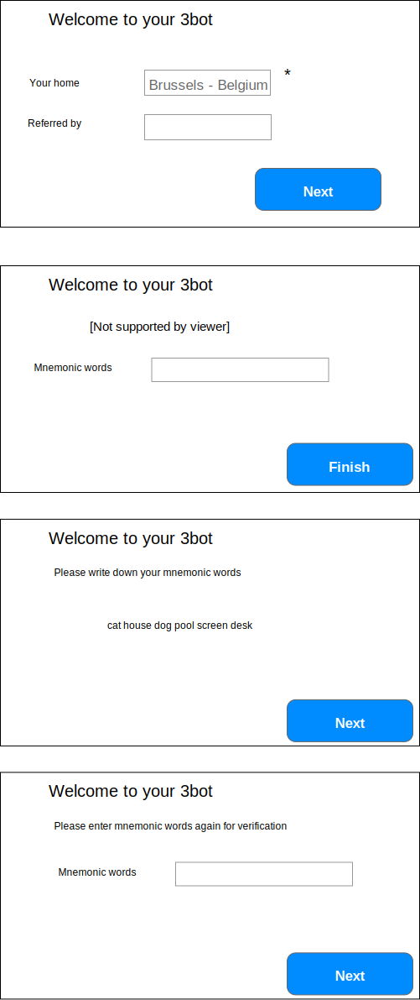

#Register

## As a user register through PC

### Assumptions
* A user can type its place and city/country will be extracted from it. This will be in an auto filling field (first version is ok with Google Maps API)
* Threefold double name or email address as reference (use regex to check usecase, descriptive for user)
* Private key requirements ????

### API
[TODO]

### Mockups

