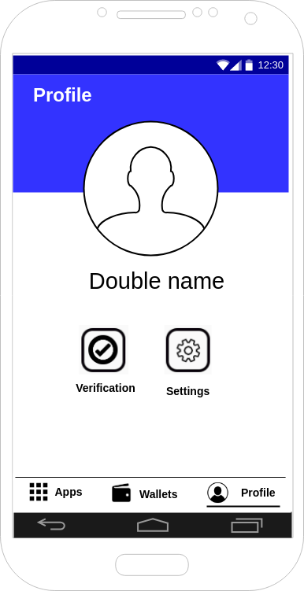

# Android App (Jimber Security App)

The 3bot android app will be developed by Jimber to support control and onboarding for 3bot users. The app will be developed as a generic application that can be used for different purposes, although the first purpose will be to connect to the 3bot UI.

## Architecture


## Functionality
Besides a webview to open 3bot web interface, the app will provide functionality to login through TOTP either on PC or web comparable to banking apps.

(suggested) 
Besides a webview to open the 3bot web interface, the app will provide functionality to login through TOTP either on a PC or on a web interface comparable to a banking app.

### Login

Users can login using their double name and fingerprint or pin


### Apps

Users have an overview of their purchased apps. 
They can buy new apps by clicking the '+' sign [AVAILABLE_IN_MVP?].
When purchasing a new app, android will install the new android app on the device and a shortcut will be created on the android homescreen.
The purchased app is also added under 'apps' in the 3bot.


Available apps: 

 * Web shell
 * Browser in browser
 * WebRTC server ( co-work)
 * Easy to create chat bots TODO

 
### Wallets

Info available in wallet.md
 
### Profile

* Verification - Mechanism to change personal id info

Users have an overview of all verification methods. When the user is verified with an institution, a check icon will be shown next to the intitution's name

When users are not verified with an institution, they can choose to verify.

* Settings - Change info

Users can change their 
* * Name -> ?
* * Email
* * Address -> ?
* * Telephone


## User stories

### As an Android user, start Jimber Security App

#### Flow
* A user starts app
* Predefined website is loaded (build defined)


### As an android user, register using TOTP
* A website is loaded, password is chosen
* The website adds TOTP key
```
 POST https://localhost:80443/api/totp 
 { “keyid” : “mainkey”, “key” : “abc123” }
```     
* The API returns 200


### As an android user, login using TOTP


### As a user, show your apps


```
GET /tfgrid/3bot/{doublename}/apps
return 
{
    [
        {
            "name": "Web Shell",
            "images": "webShell.png",
            "url" : "webshell.apk"
        },
            {
            "name": "co-work",
            "images": "cowork.png",
            "url" : "cowork.apk"
        }
    ]
}
```
### As a user, show your profile




### As a user, Show verification methods


* Show all verification institutions with a check box when verification is done
* A back button is available on top of the screen to return to the user profile

```
GET /tfgrid/3bot/{doublename}/profile/verification
{
    [
        {"InstitutionName": "Artilium", "verified": true, "verificationUrl": "http://www.artilium.com/kyc"},
        {"InstitutionName": "Belfius", "verified": false, "verificationUrl": "http://www.belfius.be/kyc"},
    ]
}
```

### As a user, show your settings


```
GET /tfgrid/3bot/{doublename}/profile/settings
 {
 “firstname” : “userFirstName”, 
 “lastName” : “userLastName”, 
 “email” : “userEmail”, 
 "addressStreet" : “userAddressStreet”,
 "addressStreetNumber" : “userAddressStreetNumber”,
 "addressZipcode" : “userAddressZipCode”,
 "addressCity" : “userAddressCity”,
 "addressCountry" : “userAddressCountry”, 
 "telephone" : “userTelephone"
 }
 ```

### As a user, update your settings


```
PUT /tfgrid/3bot/{doublename}/profile/settings
 {
 “firstname” : “userFirstName”, 
 “lastName” : “userLastName”, 
 “email” : “userEmail”, 
 "addressStreet" : “userAddressStreet”,
 "addressStreetNumber" : “userAddressStreetNumber”,
 "addressZipcode" : “userAddressZipCode”,
 "addressCity" : “userAddressCity”,
 "addressCountry" : “userAddressCountry”, 
 "telephone" : “userTelephone"
 }
 ```

#### Flow

* A website is loaded, password is inserted by user
```
GET https://localhost:80443/api/totp
Returns: {"584564"}
```
* Website logs in


The TOTP is known because the TOTP was stored by the app on the device.


