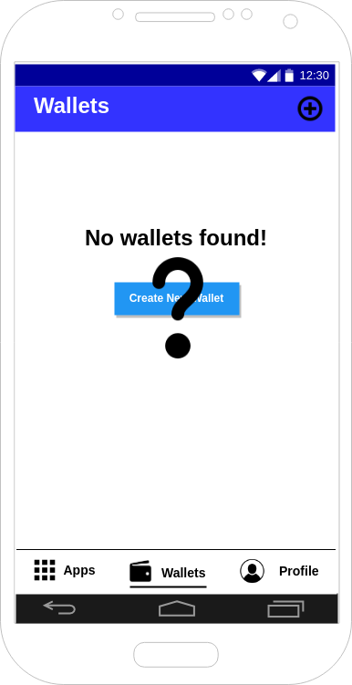

# Android App (Jimber Security App)

The 3bot android app will be developed by Jimber to support control and onboarding for 3bot users. The app will be developed as a generic application that can be used for different purposes, although the first purpose will be to connect to the 3bot UI.

## Architecture


## Functionality
Besides a webview to open 3bot web interface, the app will provide functionality to login through TOTP either on PC or web comparable to banking apps.

### Login

Users can login using their double name and [PASSWORD?]


### Apps


Users have an overview of their purchased apps. They can buy new apps by clicking the + sign.
When purchasing a new app, android will install a new app on the device. A shortcut will be created on the android homescreen.
The purchased app is also added in apps in the 3bot.


Available apps: 

 * Web shell
 * Browser in browser
 * WebRtc server ( co-work)
 * Easy to create chat bots (co-work??)

 
GET /tfgrid/3bot/{doublename}/apps

 
 
### Wallets



 * Add / upload wallet
 * Buy tft
 * Sell tft
 * view open orders
 * view order history


 * Overiew wallets
 * Orders
 * Order history
 
### Profile

* Mechanism to change personal id info


GET /tfgrid/3bot/{doublename}/profile/verification

{
    [
        {"InstitutionName": "Artilium", "verified": true},
        {"InstitutionName": "Belfius", "verified": false},
    ]
}

Users have an overview of all verification methods. When the user is verified with an institution, a check icon will be shown next to the intitution name

When users are not verified with an institution, they can choose to verify.
When users are verified to an institution, they can [REMOVEVERIFICATION?] or [RENEWVERIFICATION?]

* Change info


Users can change their 
 Name -> ?
 Email
 Address -> ?
 Telephone

GET /tfgrid/3bot/{doublename}/profile/settings
POST /tfgrid/3bot/{doublename}/profile/settings
 {
 “firstname” : “userFirstName”, 
 “lastName” : “userLastName”, 
 “email” : “userEmail”, 
 "addressStreet" : “userAddressStreet”,
 "addressStreetNumber" : “userAddressStreetNumber”,
 "addressZipcode" : “userAddressZipCode”,
 "addressCity" : “userAddressCity”,
 "addressCountry" : “userAddressCountry”, 
 "telephone" : “userTelephone"
 }


## User stories

### As an Android user, start Jimber Security App

#### Flow
* A user starts app
* Predefined website is loaded (build defined)


### As an android user, register  using TOTP
* A website is loaded, password is chosen
* The website adds TOTP key
```
 POST https://localhost:80443/api/totp 
 { “keyid” : “mainkey”, “key” : “abc123” }
```     
* The API returns 200


### As an android user, login using TOTP

#### Flow

* A website is loaded, password is inserted by user
```
GET https://localhost:80443/api/totp
Returns: {"584564"}
```
* Website logs in


The TOTP is known because the TOTP was stored by the app on the device.


